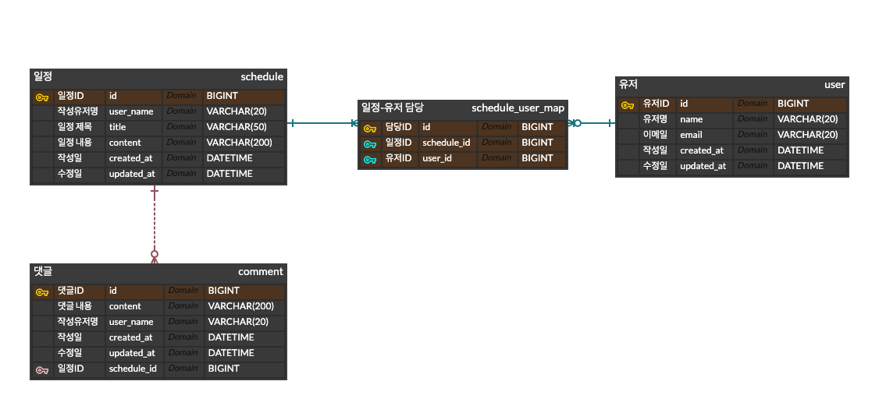

# ScheduleApp-JPA

<br>
<br>

# API 명세서

<br>


## 1. 유저 API

| 기능       | Method | URL           | request                                                                                                                                           | response                                                                                                                                       | 상태 코드        |
|------------|--------|---------------|---------------------------------------------------------------------------------------------------------------------------------------------------|------------------------------------------------------------------------------------------------------------------------------------------------|--------------|
| 유저 등록    | POST   | /users/signup | `{"email" : "string1@a.com", "userName" : "string1", "password" : "string1", "admin" : true, "adminToken" : "AAABnvxRVklrnYxKZ0aHgTBcXukeZygoC"}` | `{"id": 1, "userName": "string1", "email": "string1@a.com", "createdAt": "2024-08-28T15:45:04.274563", "updatedAt": "2024-08-28T15:45:04.269745", "role": "ADMIN"}` | 201 : 정상 등록  |
| 유저 로그인   | POST   | /users/login  | `{"email" : "string1@a.com", "password" : "string1"}`                                                                                             | -                                                                                                                                              | 200 : 정상 로그인 |
| 유저 조회    | GET    | /users/{id}   | -                                                                                                                                                 | `{"id": 1, "userName": "string1", "email": "string1@a.com", "createdAt": "2024-08-28T15:32:16.72474", "updatedAt": "2024-08-28T15:40:13.726104", "role": "ADMIN"}`   | 200 : 정상 조회  |
| 유저 목록 조회 | GET    | /users        | -                                                                                                                                                 | `[{"id": 1, "userName": "string1", "email": "string1@a.com", "createdAt": "2024-08-28T15:32:16.72474", "updatedAt": "2024-08-28T15:40:13.726104", "role": "ADMIN"}]` | 200 : 정상 조회  |
| 유저 수정    | PUT    | /users/{id}   | `{"userName": "string2", "email" : "string2@a.com", "password" : "string2"}`                                                                      | `{"id": 1, "userName": "string2", "email": "string2@a.com", "createdAt": "2024-08-28T15:32:16.72474", "updatedAt": "2024-08-28T15:48:52.392694", "role": "ADMIN"}`   | 200 : 정상 수정  |
| 유저 삭제    | DELETE | /users/{id}   | -                                                                                                                                                 | -                                                                                                                                              | 200 : 정상 삭제  |

<br>

## 2. 일정 API
| 기능        | Method | URL              | request                                                                                                             | response                                                                                                                                                      | 상태 코드       |
|-------------|--------|------------------|---------------------------------------------------------------------------------------------------------------------|---------------------------------------------------------------------------------------------------------------------------------------------------------------|----------------|
| 일정 등록     | POST   | /schedules       | `{"userID" : 1, "userName" : "string1", "title" : "String", "content" : "String"}`                                  | `{"id": 1, "userId": 1, "userName": "string1", "title": "String", "content": "String", "createdAt": "2024-08-28T16:01:18.752902", "updatedAt": "2024-08-28T16:01:18.056242", "weather": "Clear and Cold", "userEmail": "string1@a.com"}` | 201 : 정상 등록 |
| 일정 조회     | GET    | /schedules/{id}  | -                                                                                                                   | `{"id": 1, "userId": 1, "userNames": "string1", "userEmails": "string1@a.com", "title": "String", "content": "String", "createdAt": "2024-08-28T16:01:18.752902", "updatedAt": "2024-08-28T16:01:18.056242"}`                            | 200 : 정상 조회 |
| 일정 목록 조회 | GET    | /schedules?page= | -                                                                                                                   | `[{"id": 1, "userId": 1, "userNames": "string1", "userEmails": "string1@a.com", "title": "String", "content": "String", "createdAt": "2024-08-28T16:01:18.752902", "updatedAt": "2024-08-28T16:01:18.056242"}]`                           | 200 : 정상 조회 |
| 일정 수정     | PUT    | /schedules/{id}  | `{"userID" : 1, "userName" : "string2", "userEmail" : "string2@a.com", "title" : "string2", "content" : "string2"}` | `{"id": 1, "userId": 1, "userName": "string2", "title": "string2", "content": "string2", "createdAt": "2024-08-28T16:01:18.752902", "updatedAt": "2024-08-28T16:10:06.757293", "weather": "Clear and Cold", "userEmail": "string2@a.com"}` | 200 : 정상 수정 |
| 일정 삭제     | DELETE | /schedules/{id}  | -                                                                                                                   | -                                                                                                                                                             | 200 : 정상 삭제 |

<br>

## 3. 댓글 API


| 기능       | Method | URL            | request       | response | 상태 코드       |
|----------|--------|----------------|---------------|----------|-------------|
| 댓글 등록    | POST   | /comments      | request body  | 등록 정보    | 200 : 정상 등록 |
| 댓글 조회    | GET    | /comments/{id} | request param | 단건 응답 정보 | 200 : 정상 조회  |
| 댓글 목록 조회 | GET    | /comments      | request body  | 다건 응답 정보 | 200 : 정상 조회  |
| 댓글 수정    | PUT    | /comments/{id} | request body  | 수정 정보    | 200 : 정상 수정 |
| 댓글 삭제    | DELETE | /comments/{id} | request param | 삭제 정     | 200 : 정상 삭제 |

<br>


<br>
<br>


# ERD




<br>
<br>

# 테이블 생성 SQL

```sql
CREATE TABLE `schedule` (
                            `id` BIGINT NOT NULL AUTO_INCREMENT,
                            `user_name` VARCHAR(20) NULL,
                            `title` VARCHAR(50) NOT NULL,
                            `content` VARCHAR(200) NOT NULL,
                            `created_at` DATETIME NULL,
                            `updated_at` DATETIME NULL,
                            PRIMARY KEY (`id`)
);

CREATE TABLE `user` (
                        `id` BIGINT NOT NULL AUTO_INCREMENT,
                        `name` VARCHAR(20) NOT NULL,
                        `email` VARCHAR(20) NOT NULL,
                        `created_at` DATETIME NOT NULL,
                        `updated_at` DATETIME NULL,
                        PRIMARY KEY (`id`)
);

CREATE TABLE `comment` (
                           `id` BIGINT NOT NULL AUTO_INCREMENT,
                           `content` VARCHAR(200) NOT NULL,
                           `user_name` VARCHAR(20) NULL,
                           `created_at` DATETIME NULL,
                           `updated_at` DATETIME NULL,
                           `schedule_id` BIGINT NOT NULL,
                           PRIMARY KEY (`id`),
                           FOREIGN KEY (`schedule_id`) REFERENCES `schedule` (`id`)
);

CREATE TABLE `schedule_user_map` (
                                     `id` BIGINT NOT NULL AUTO_INCREMENT,
                                     `schedule_id` BIGINT NOT NULL,
                                     `user_id` BIGINT NOT NULL,
                                     PRIMARY KEY (`id`),
                                     FOREIGN KEY (`schedule_id`) REFERENCES `schedule` (`id`),
                                     FOREIGN KEY (`user_id`) REFERENCES `user` (`id`)
);

```
