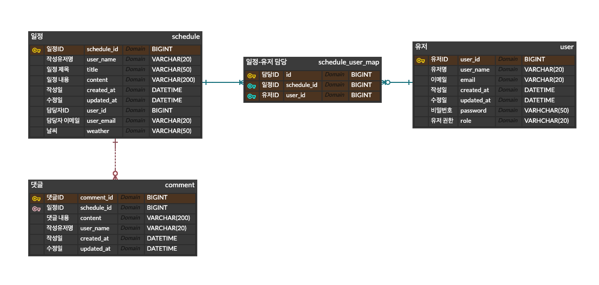

# ScheduleApp-JPA

<br>
<br>

# 프로젝트 소개: SPRING BOOT와 JPA를 이용한 일정 관리 어플리케이션
<br>
<br>

# 프로젝트 기간:  2024.08.19 ~ 2024.08.26
<br>
<br>

# 기술 스택: 

- JAVA(1.17)
- MySQL
- JPA(Hibernate)
- Postman
- Spring Boot(3.3.2)
- JWT
- RestTemplate

<br>
<br>

# 요구 사항 및 기능:

## 1. 일정

1. 일정은 저장, 단건 조회, 목록 조회, 수정, 삭제가 가능하고 담당 유저들을 추가할 수 있습니다.
2. 일정은 일정 ID, 담당 유저명, 담당 유저 ID,  할일 제목, 할일 내용, 작성일, 수정일, 날씨 필드를 갖고 있습니다.
3. 일정에는 RestTemplate을 통해 가져온 날씨 정보가 있습니다.
4. 유저가 일정에 댓글을 달 수 있습니다.
5. JWT를 이용한 인증을 통해 관리자가 일정을 수정, 삭제할 수 있습니다.
6. 일정을 페이지별로 조회할 수 있습니다.(기본 페이지당 10개씩)

<br>

## 2. 유저

1. 유저를 저장, 단건 조회, 목록 조회, 수정, 삭제할 수 있습니다.
2. 유저는 유저ID, 이메일, 유저명, 비밀번호, 권한, 생성일, 수정일 필드를 갖고 있습니다.
3. 유저는 관리자와 일반 유저로 구분됩니다.
4. 유저는 JWT를 이용한 인증을 통해 로그인할 수 있습니다.

<br>

## 3. 댓글

1. 댓글을 저장, 단건 조회, 목록 조회, 수정, 삭제할 수 있습니다.
2. 댓글은 댓글 ID, 일정 ID, 댓글 내용, 댓글 작성자, 작성일, 수정일 필드를 갖고 있습니다.
3. 댓글은 일정에 속해 있습니다.

## 4. 인증 및 인가
1. JWT 구현을 통해 로그인을 처리합니다.
2. JWT를 이용한 인가를 통해 관리자만 일정을 수정, 삭제할 수 있습니다.

<br>
<br>

# API 명세서

<br>


## 1. 유저 API

| 기능       | Method | URL           | request                                                                                                                                           | response                                                                                                                                       | 상태 코드                                           |
|------------|--------|---------------|---------------------------------------------------------------------------------------------------------------------------------------------------|------------------------------------------------------------------------------------------------------------------------------------------------|-------------------------------------------------|
| 유저 등록    | POST   | /users/signup | `{"email" : "string1@a.com", "userName" : "string1", "password" : "string1", "admin" : true, "adminToken" : "AAABnvxRVklrnYxKZ0aHgTBcXukeZygoC"}` | `{"id": 1, "userName": "string1", "email": "string1@a.com", "createdAt": "2024-08-28T15:45:04.274563", "updatedAt": "2024-08-28T15:45:04.269745", "role": "ADMIN"}` | 201 : CREATED                                   |
| 유저 로그인   | POST   | /users/login  | `{"email" : "string1@a.com", "password" : "string1"}`                                                                                             | -                                                                                                                                              | 200 : OK, 400 : BAD REQUEST, 401 : UNAUTHORIZED |
| 유저 조회    | GET    | /users/{id}   | -                                                                                                                                                 | `{"id": 1, "userName": "string1", "email": "string1@a.com", "createdAt": "2024-08-28T15:32:16.72474", "updatedAt": "2024-08-28T15:40:13.726104", "role": "ADMIN"}`   | 200 : OK                                        |
| 유저 목록 조회 | GET    | /users        | -                                                                                                                                                 | `[{"id": 1, "userName": "string1", "email": "string1@a.com", "createdAt": "2024-08-28T15:32:16.72474", "updatedAt": "2024-08-28T15:40:13.726104", "role": "ADMIN"}]` | 200 : OK                                        |
| 유저 수정    | PUT    | /users/{id}   | `{"userName": "string2", "email" : "string2@a.com", "password" : "string2"}`                                                                      | `{"id": 1, "userName": "string2", "email": "string2@a.com", "createdAt": "2024-08-28T15:32:16.72474", "updatedAt": "2024-08-28T15:48:52.392694", "role": "ADMIN"}`   | 200 : OK                                        |
| 유저 삭제    | DELETE | /users/{id}   | -                                                                                                                                                 | -                                                                                                                                              | 200 : OK                                        |

<br>

## 2. 일정 API
| 기능          | Method | URL              | request                                                                                                        | response                                                                                                                                                                                                                                   | 상태 코드                      |
|-------------|--------|------------------|----------------------------------------------------------------------------------------------------------------|--------------------------------------------------------------------------------------------------------------------------------------------------------------------------------------------------------------------------------------------|----------------------------|
| 일정 등록       | POST   | /schedules       | `{"userID" : 1, "userName" : "string1", "title" : "String", "content" : "String"}`                             | `{"id": 1, "userId": 1, "userName": "string1", "title": "String", "content": "String", "createdAt": "2024-08-28T16:01:18.752902", "updatedAt": "2024-08-28T16:01:18.056242", "weather": "Clear and Cold", "userEmail": "string1@a.com"}`   | 201 : CREATED              |
| 일정 조회       | GET    | /schedules/{id}  | -                                                                                                              | `{"id": 1, "userId": 1, "userNames": "string1", "userEmails": "string1@a.com", "title": "String", "content": "String", "createdAt": "2024-08-28T16:01:18.752902", "updatedAt": "2024-08-28T16:01:18.056242"}`                              | 200 : OK                   |
| 일정 목록 조회    | GET    | /schedules?page= | -                                                                                                              | `[{"id": 1, "userId": 1, "userNames": "string1", "userEmails": "string1@a.com", "title": "String", "content": "String", "createdAt": "2024-08-28T16:01:18.752902", "updatedAt": "2024-08-28T16:01:18.056242"}]`                            | 200 : OK                   |
| 일정 수정       | PUT    | /schedules/{id}  | `{"userID" : 1, "userName" : "string2", "userEmail" : "string2@a.com", "title" : "string2", "content" : "string2"}` | `{"id": 1, "userId": 1, "userName": "string2", "title": "string2", "content": "string2", "createdAt": "2024-08-28T16:01:18.752902", "updatedAt": "2024-08-28T16:10:06.757293", "weather": "Clear and Cold", "userEmail": "string2@a.com"}` | 200 : OK, 403 : FORBIDDEN	 |
| 일정 삭제       | DELETE | /schedules/{id}  | -                                                                                                              | -                                                                                                                                                                                                                                          | 200 : OK, 403 : FORBIDDEN  |
| 일정 담당 유저 추가 | POST   | /schedules/{id}/assign-users                | `{"assignedUserIdList" : [2,3]}`                                                                                                               | -                                                                                                                                                                                                | 200 : OK                   |
<br>

## 3. 댓글 API


| 기능             | Method | URL            | request       | response                                                      | 상태 코드         |
|------------------|--------|----------------|---------------|---------------------------------------------------------------|---------------|
| 댓글 작성        | POST   | /comments      | `{ "scheduleId": 2, "userName": "string", "content": "string" }` | `{ "id": 1, "userName": "string", "content": "string", "createdAt": "2024-08-28T16:42:43.541563", "updatedAt": "2024-08-28T16:42:43.529951" }` | 201 : CREATED |
| 댓글 조회        | GET    | /comments/{id} | -             | `{ "id": 1, "userName": "string", "content": "string", "createdAt": "2024-08-28T16:42:43.541563", "updatedAt": "2024-08-28T16:42:43.529951" }` | 200 : OK      |
| 댓글 전체 조회   | GET    | /comments      | -             | `[ { "id": 1, "userName": "string", "content": "string", "createdAt": "2024-08-28T16:42:43.541563", "updatedAt": "2024-08-28T16:42:43.529951" } ]` | 200 : OK   |
| 댓글 수정        | PUT    | /comments/{id} | `{ "userName": "string", "content": "string" }` | `{ "id": 1, "userName": "string", "content": "string", "createdAt": "2024-08-28T16:42:43.541563", "updatedAt": "2024-08-28T16:45:39.055443" }` | 200 : OK   |
| 댓글 삭제        | DELETE | /comments/{id} | -             | -                                                             | 200 : OK   |

<br>


<br>
<br>


# ERD




<br>
<br>

# 테이블 생성 SQL

```sql
CREATE TABLE `schedule` (
                            `schedule_id`	BIGINT	NULL,
                            `user_name`	VARCHAR(20)	NULL,
                            `title`	VARCHAR(50)	NOT NULL,
                            `content`	VARCHAR(200)	NOT NULL,
                            `created_at`	DATETIME	NULL,
                            `updated_at`	DATETIME	NULL,
                            `user_id`	BIGINT	NULL,
                            `user_email`	VARCHAR(20)	NULL,
                            `weather`	VARCHAR(50)	NULL
);

CREATE TABLE `user` (
                        `user_id`	BIGINT	NOT NULL,
                        `user_name`	VARCHAR(20)	NOT NULL,
                        `email`	VARCHAR(20)	NOT NULL,
                        `created_at`	DATETIME	NOT NULL,
                        `updated_at`	DATETIME	NULL,
                        `password`	VARHCHAR(50)	NULL,
                        `role`	VARHCHAR(20)	NULL
);

CREATE TABLE `comment` (
                           `comment_id`	BIGINT	NOT NULL,
                           `schedule_id`	BIGINT	NOT NULL,
                           `content`	VARCHAR(200)	NOT NULL,
                           `user_name`	VARCHAR(20)	NULL,
                           `created_at`	DATETIME	NULL,
                           `updated_at`	DATETIME	NULL
);

CREATE TABLE `schedule_user_map` (
                                     `id`	BIGINT	NOT NULL,
                                     `schedule_id`	BIGINT	NOT NULL,
                                     `user_id`	BIGINT	NOT NULL
);

ALTER TABLE `schedule` ADD CONSTRAINT `PK_SCHEDULE` PRIMARY KEY (
                                                                 `schedule_id`
    );

ALTER TABLE `user` ADD CONSTRAINT `PK_USER` PRIMARY KEY (
                                                         `user_id`
    );

ALTER TABLE `comment` ADD CONSTRAINT `PK_COMMENT` PRIMARY KEY (
                                                               `comment_id`
    );

ALTER TABLE `schedule_user_map` ADD CONSTRAINT `PK_SCHEDULE_USER_MAP` PRIMARY KEY (
                                                                                   `id`,
                                                                                   `schedule_id`,
                                                                                   `user_id`
    );

ALTER TABLE `schedule_user_map` ADD CONSTRAINT `FK_schedule_TO_schedule_user_map_1` FOREIGN KEY (
                                                                                                 `schedule_id`
    )
    REFERENCES `schedule` (
                           `schedule_id`
        );

ALTER TABLE `schedule_user_map` ADD CONSTRAINT `FK_user_TO_schedule_user_map_1` FOREIGN KEY (
                                                                                             `user_id`
    )
    REFERENCES `user` (
                       `user_id`
        );


```
